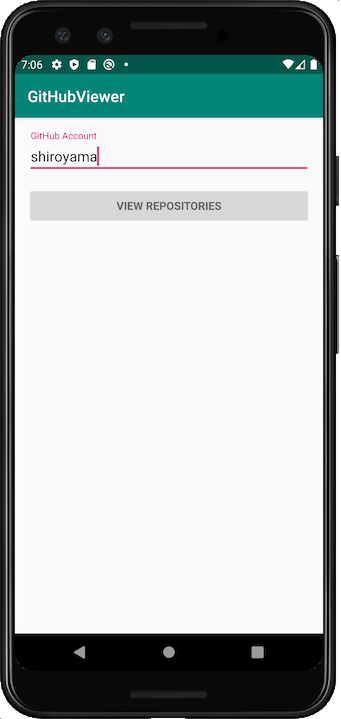
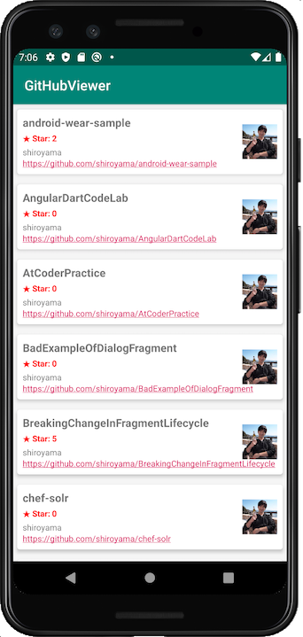
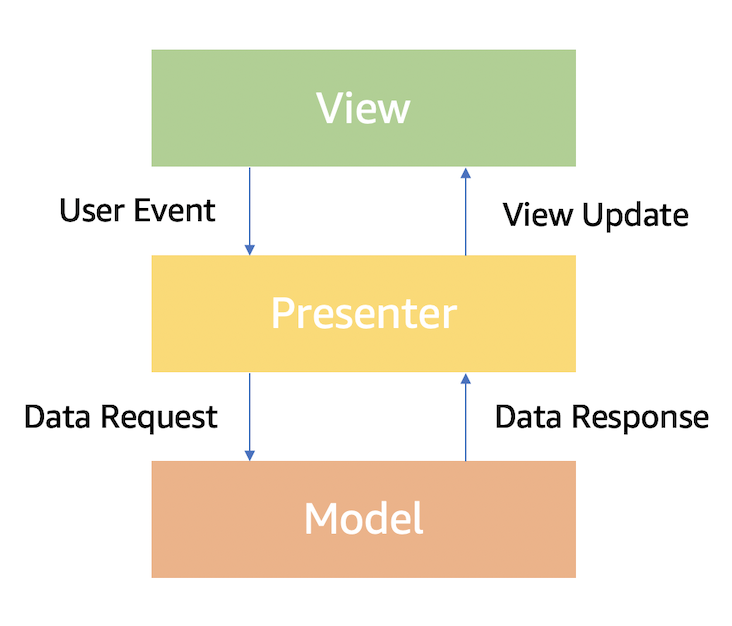
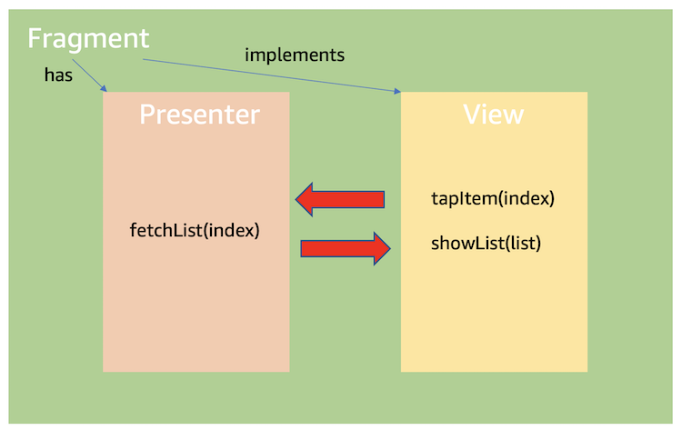
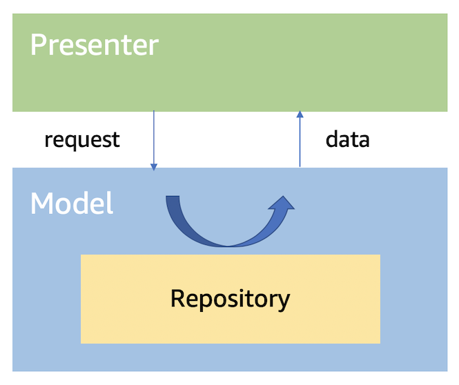
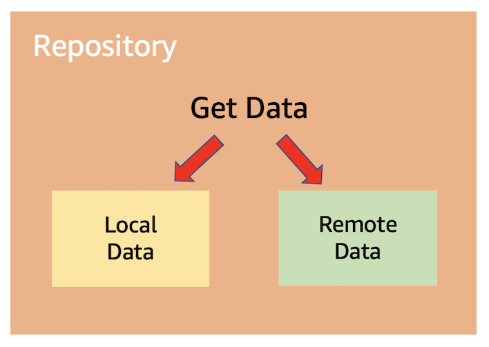

# MVP Architecture - GitHub Repository Viewer

## Features




## Overview

The functionality of this app is trivial. Rather, this app is intended to illustrate a robust architecture. This app is made with the so-called MVP architecture.

## MVP Architecture

The MVP (Model-View-Presenter) architecture is a derivative of the well-known MVC (Model-View-Controller) architecture and is one of the best practices for building user interfaces.



### View

View focuses on responding to user touch events and displaying the results of processing. View here does NOT mean `android.view.View`. It is defined as an interface, and `Fragment` or `Activity` is responsible for implementing it.



Why do we need such a layer? This is because ViewController (`Fragment` or `Activity`), as the name implies, is often overloaded with both View and Controller responsibilities. Views focus solely on bridging user events and UI changes. The role of fetching data is delegated to Presenter. I'll discuss Presenter shortly.

### Presenter

Presenter is a bridge between View and Model. When the View receives a user event, it may try to get the necessary data accordingly. At this time, the View does not do this directly, but asks the Presenter to do it. Presenter notifies View when it gets data from Model. View focuses on just displaying it. It is out of interest where and how the data was obtained.



### Model

A model is simply business logic. There are various ways to design a model. Here I have adopted the Usecase & Repository pattern.



Usecase is a use case as the name implies, and it is named for the purpose, for example, "GetData". Where does "GetData" get data from? It is from Repository.

Repository is defined as an interface, and only input and output are defined.　The data may reside in a local database, or it may come from a remote API server, which is of no interest to the use case.　This design minimizes component interest and achieves a well-defined architecture that is easy to test.

## Architecture

From now on, I will explain the structure of the actual source code based on the overview so far.　The hierarchical structure of the source code is as follows.

 - presentation
   - view
     - activity / fragment
     - contract … Contract between View and Presenter ⭐️
   - presenter
 - domain
   - usecase … Usecase that fetches data from repository
 - infrastructure
   - repository
     - datasource … Data from local or remote

### View Contract

`presentation.view.contract` is where the contract between the View and Presenter is defined. For example, look at the following screen.


Here, the system tells the Presenter that the user has clicked the button, and the Presenter validates the input, and based on the result Presenter tries to migrate to the next screen. If there is a problem, ask View to display the error.

The following code is an example of a View and Presenter contract.

```kotlin
// simplified

interface AccountInputContract {
    interface View {
        fun showInputError(errorRes: Int)
    }

    interface Interaction {
        fun onClickViewRepositoryButton(input: String)
    }
}
```

`Fragment` implements `Contract.View`, notifies click events to Presenter, and displays the results from Presenter.

```kotlin
// simplified

class AccountInputFragment : Fragment(),
    AccountInputContract.View {

    @Inject
    override lateinit var presenter: AccountInputPresenter

    @BindView(R.id.account)
    lateinit var accountView: EditText

    // user event
    @OnClick(R.id.view_repository_button)
    fun onClickViewRepositoryButton(button: Button) {
        presenter.onClickViewRepositoryButton(accountView.text.toString())
    }

    // show error
    override fun showInputError(errorRes: Int) {
        accountView.error = getString(errorRes)
    }
}
```

And Presenter implements `Contract.Interaction` and calls business logic at the request of View. The code would look like this:

```kotlin
// simplified

class AccountInputPresenter :  AccountInputContract.Interaction {
    override fun onClickViewRepositoryButton(input: String) {
        if (!isValid(input)) {
            view.showInputError(R.string.error)
            return
        }
        nextScreen()
    }
}
```

### Repository

As described earlier, the Repository defines only the input and output of business logic, and the actual data acquisition is implemented in `datasource`. The following is an example of a repository using `remoteDataSource` that retrieves information using the REST API. Of course, you could also define a `remoteDataSource` that caches information in a local database here.

```kotlin
class GitHubInfraRepository @Inject constructor(
    private val remoteDataSource: RemoteGitHubDataSource,
    private val mapper: RepositoryMapper
) : GitHubRepository {
    override fun listRepos(user: String): Single<List<RepositoryModel>> {
        return remoteDataSource
            .listRepos(user)
            .map { mapper.convert(it) }
    }
}
```

What `mapper` is doing here is converting the data structure of the infrastructure layer to the data structure of the model layer. Entities may differ depending on the type of data source, but by converting the data structure for each layer in this way, even if the library used by the data source is completely replaced, you can use Repository consistently.

### Usecase

Finally, Usecase is a bit tricky.　In mobile application development, data moves between a UI thread that updates the view and a worker thread that executes asynchronous processing.　To handle this safely and prevent "callback hell", I have adopted RxJava / RxKotlin.

Usecase is the place to bridge the thread of RxJava asynchronous processing and UI callbacks.　To prevent RxJava's boilerplate, I have created a generic, type-safe `UseCase` that allows the user to simply pass a success or failure lambda expression to receive the result.　Actually, I prepared `SingleUseCase` and` CompletableUseCase` depending on the type of Observable, so please check it.

```kotlin
abstract class UseCase<OBSERVABLE_TYPE, RESPONSE_TYPE : Any, PARAMS>(
    val subscribeSchedulerProvider: SubscribeSchedulerProvider,
    val observeSchedulerProvider: ObserveSchedulerProvider,
    private val compositeDisposable: CompositeDisposable
) {
    abstract fun buildObservable(params: PARAMS): OBSERVABLE_TYPE

    abstract fun execute(
        onNext: (RESPONSE_TYPE) -> Unit,
        onError: (Throwable) -> Unit,
        onComplete: () -> Unit,
        params: PARAMS
    )

    abstract fun execute(params: PARAMS): RESPONSE_TYPE

    protected fun addDisposable(disposable: Disposable): Boolean {
        return compositeDisposable.add(disposable)
    }

    fun clearDisposable() {
        compositeDisposable.clear()
    }

}
```

"GetRepositories" which is a UseCase that uses this is as follows. Sorry for the confusing name, but this Repository has nothing to do with the Repository Pattern and means a GitHub repository.

```kotlin
class GetRepositories @Inject constructor(
    subscribeSchedulerProvider: SubscribeSchedulerProvider,
    observeSchedulerProvider: ObserveSchedulerProvider,
    compositeDisposable: CompositeDisposable,
    private val gitHubRepository: GitHubRepository
) : SingleUseCase<List<RepositoryModel>, GetRepositories.Params>(
    subscribeSchedulerProvider,
    observeSchedulerProvider,
    compositeDisposable
) {
    override fun buildObservable(params: Params): Single<List<RepositoryModel>> {
        // This is the only important part.
        return gitHubRepository.listRepos(params.user)
    }

    data class Params(val user: String)

}
```

Finally, the code that uses this UseCase is like below: As you can see, this code is written in Presenter. Calling business logic is the responsibility of Presenter.

```kotlin
val params = GetRepositories.Params(name)
getRepositories.execute(
    { repoModels: List<RepositoryModel> ->
        view.showList(mapper.convert(repoModels))
    },
    { throwable: Throwable ->
        Log.e(
            TAG, throwable.message, throwable
        )
    },
    params
)
```

This is the overall architecture. Do you think it takes a lot of work to do a little thing?　Well, maybe even while the app is small. However, apps grow rapidly and unexpectedly. To have a robust architecture and clean code for your team, it's important to design well first.

## Test

Such an architecture makes writing unit tests easier and helps improve product quality.

### Remote Data Source

I use Retrofit and OkHttp for remote data source, that is, REST API communication. You can use a mock library to stub the return value, but here I use MockWebServer. MockWebServer is a local HTTP server for OkHttp, and can return a response as if it were production.

```Kotlin
val mockWebServer = MockWebServer()

val dispatcher: Dispatcher =
    object : Dispatcher() {
        @Throws(InterruptedException::class)
        override fun dispatch(request: RecordedRequest): MockResponse {
            if (request.path == null) {
                return MockResponse().setResponseCode(400)
            }
            if (request.path!!.matches("/users/srym/repos/?.*".toRegex())) {
                return MockResponse().setBody(readJsonFromResources("users_srym_repos.json")!!)
                    .setResponseCode(200)
            }
        }
    }
mockWebServer.dispatcher = dispatcher
mockWebServer.start()
val retrofit = Retrofit.Builder()
    .baseUrl(mockWebServer.url(""))
    .addCallAdapterFactory(RxJava2CallAdapterFactory.create())
    .addConverterFactory(GsonConverterFactory.create(Gson()))
    .client(OkHttpClient())
    .build()
val gitHubService: GitHubService = retrofit.create(GitHubService::class.java)
restGitHubDataSource = RestGitHubDataSource(gitHubService)
```

With this preparation, you can actually send a request to the local environment for testing. Since the return value is an RxJava object, wait with `.test().await()` method.

```kotlin
val repositories: List<RepositoryEntity> = restGitHubDataSource.listRepos("srym")
    .test()
    .await()
    .values()[0]

assertThat(repositories)
    .isNotEmpty
    .hasSize(30)
assertThat(repositories[0].name).isEqualTo("dotfiles")
```

### Presenter and View

Presenter and View testing are the essence of this architecture. Because View is defined as an interface, it is possible to test without depending on Fragment. When testing, mock the View and set it to the Presenter to verify the interaction between the Presenter and the View.

```kotlin
private val validator: AccountValidator = spy(AccountValidator())
private lateinit var view: AccountInputContract.View
private lateinit var accountInputPresenter: AccountInputPresenter

@Before
fun setUp() {
    view = mock()
    whenever(view.getFragmentContext()).thenReturn(mock())
    accountInputPresenter = AccountInputPresenter(validator)
    accountInputPresenter.view = view
}
```

In this way, when a user touch event is passed to Presenter, business logic is executed, and it is easy to verify that the result is notified to View.

```kotlin
@Test
fun onClickViewRepositoryButton_showError_whenInvalidInput() {
    accountInputPresenter.onClickViewRepositoryButton("abc@123")
    verify(view, times(1)).showInputError(eq(R.string.error_invalid_account))
}
```

The `verify()` method verifies the callback from the Presenter to the View. After that, you can write tests for all layers by applying such techniques.